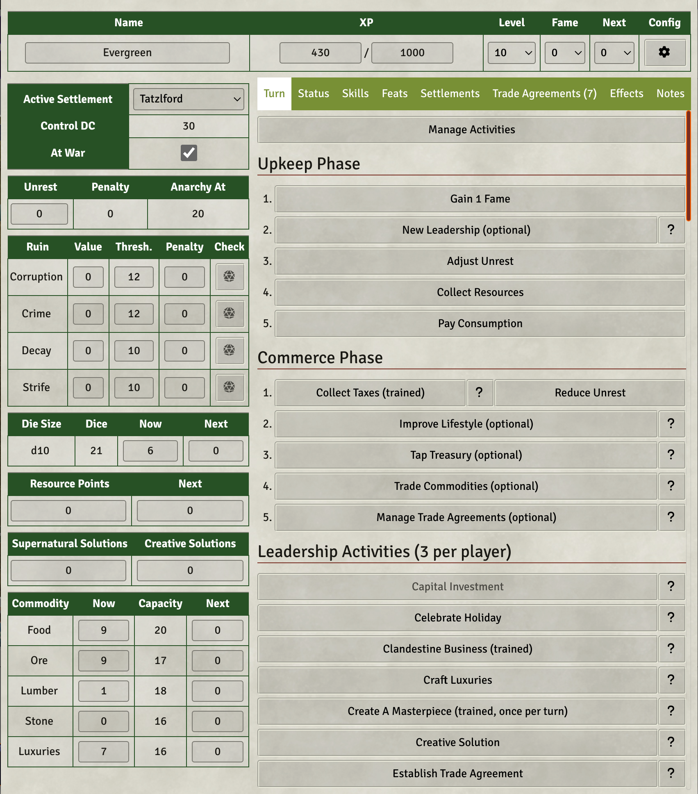
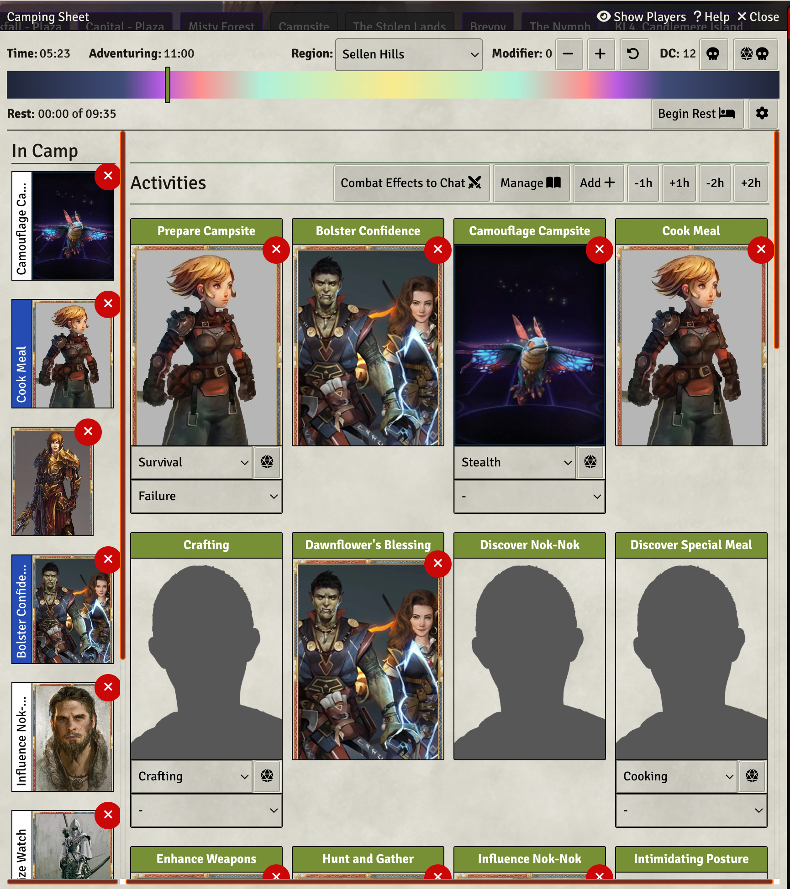

# Kingmaker Tools (Unofficial)

This module ships macros, journal entries, roll tables, effect items, additional tooling for OGL/CUP licensed content
from the Kingmaker Adventure Path for Pathfinder 2nd Edition.

If you are interested in hacking on the code base, take a look at the [Kotlin JS Primer](./Kotlin%20JS%20Primer.md) for a quick intro on how to interact with the js api. 

## Licensing

All Pathfinder content uses the [Open Gaming License](./OpenGameLicense.md) and [CUP](https://paizo.com/community/communityuse)

> This FoundryVTT module uses trademarks and/or copyrights owned by Paizo Inc., used under Paizo's Community Use
> Policy (paizo.com/communityuse). We are expressly prohibited from charging you to use or access this content. This
> FoundryVTT module is not published, endorsed, or specifically approved by Paizo. For more information about Paizo Inc.
> and Paizo products, visit paizo.com.

The source code is licensed under the AGPLv3 license.

All images in the [static/img/structures](static/img/structures) folder are licensed under [CC0 - Public Domain](https://creativecommons.org/publicdomain/zero/1.0/) by [Mark Pearce](https://github.com/MarkPearce). They were [generated and retouched using a MidJourney subscriber account](https://github.com/BernhardPosselt/pf2e-kingmaker-tools/issues/76). According to their [Terms of Service](https://docs.midjourney.com/docs/terms-of-service), subscribers to MidJourney that are not part of a company own all the generated images.

## Installation

The package is available through the [module registry](https://foundryvtt.com/packages/pf2e-kingmaker-tools)

## Functionality

This module ships with implementations for all the extra mechanics provided in the 2e Kingmaker Adventure Path, including optional and popular homebrew from Vance & Kerenshara:

* Camping Sheet
* Kingdom Sheet
* Weather
* Level 1 Statblocks for companions not included in the Companion Guide

Furthermore, this module provides:

* Various macros that I use in my own game
* Journals containing various rules and tips
* Combat Track integration

### House Rules & GM Tips

You can look up my tips and house rules [here](./docs/house-rules.md)

### Official Kingmaker Module Integration

If you've enabled the official module, the following things are automatically taken care of:

* Token Mappings for all companions and structures except for a few exceptions (see Manual journal)
* Weather Sound Effects for rain, rainstorms, blizzard and snow
* Default and Region combat tracks
* Rolltable integration for:
    * Kingdom Events
    * Random Encounters
    * Cult Events

### Screenshots

## Development

### Setup

Install the following things:

* JDK 21
* git
* node
* yarn

First, clone the repository into a local folder, e.g. **/home/bernhard/dev**:

    cd /home/bernhard/dev
    git clone https://github.com/BernhardPosselt/pf2e-kingmaker-tools.git 

Then link this directory to your foundry data folder:

    ln -s /home/bernhard/dev/pf2e-kingmaker-tools/ /home/bernhard/.local/share/FoundryVTT/Data/modules/pf2e-kingmaker-tools/

First, build the old JS code using:

    cd oldsrc
    yarn install
    yarn run build

Then, you can keep building the project using:

    ./gradlew assemble

or if you want to both build it and run its tests:

    ./gradlew build

To execute tests run:

    ./gradlew jsTest

Finally, start foundry

    cd dev/FoundryVTT-12.330/
    ./foundryvtt

You can release a new version using:

    ./release.sh "1.1.1" "$GITHUB_TOKEN" "$FOUNDRY_TOKEN"

### Enable Schema Autocompletion Support in IntelliJ

Some files are in JSON rather than actual code. To get autocompletion for these in IntelliJ, you need to enable custom schemas.

In settings, go to **Languages & Frameworks > Schemas and DTDs > JSON Schema Mappings**.

Click on the + to add a new mapping for each schema. Then add the following (see a list of values further down below):

* **Name**: Name of the Schema
* **Schema file or URL**: Path to the Schema file in [./schemas/](./schemas/)
* **Schema Version**: Always **JSON Schema version 7**
* Then click on the **+** below and **Add file pattern or path** 
 
Schemas:

* Recipes:
  * **Name**: Recipes
  * **Schema file or URL**: schemas/recipes.json
  * **Pattern**: src/\*/\*\*/recipes.json
 